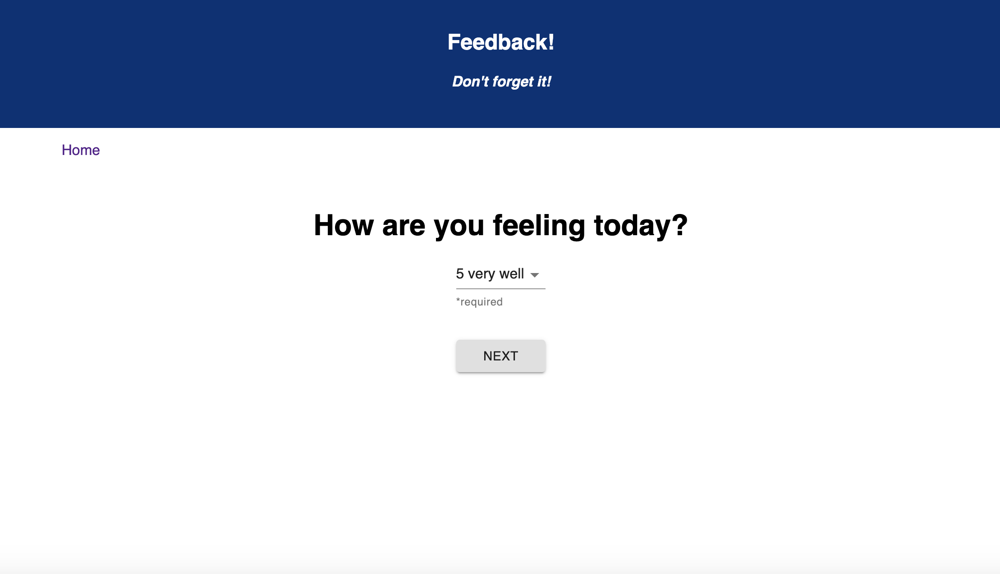
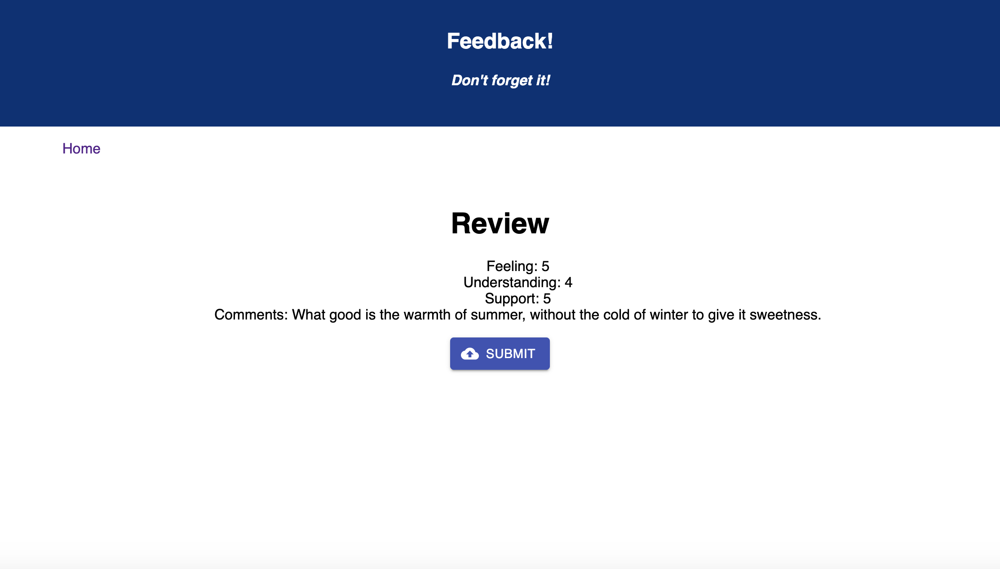

# Redux Feedback Loop
---

## Description

Duration: 1 Weekend Sprint

- Welcome to the Redux Feedback loop

### Input Validation

- Each step only allows the user to advance to the next step if a score was provided. Be sure to provide a value.

- The `Comments` step does not need to be validated, an empty value is okay.

## THE REVIEW COMPONENT

- The last step of the process will allow the user to review their feedback.

- The `Review` step has a submit button which will be clicked on to actually submit the completed feedback to the server.

- When the submit button is clicked, the submission is saved in the database and all local values are reset. The user sees a submission success page. They can then click the button to take a new survey.

## THE HOME BUTTON

- the home button can be clicked at any time to restart feedback session
 
---
Link
---
---
Screen shot

---

## Installation

1. fork this repository to your own github account
2. git clone onto local computer using terminal
3. open with code editor of your choice
4. npm install
5. npm start in terminal
6. npm run client in one terminal
7. npm run server in another terminal
8. go to http://localhost:3000/ to see redux feedback loop
---

## Usage

1. click begin feedback to start feedback form 
2. pick a number from the dropdown menu
3. click next
4. continue this process 3 more times
5. review data and click submit
6. click "leave new feedback" if you wish to give another round of feedback
7. the home navigation link can be clicked at any time to restart feedback session
---
## Built With

- html
- css
- javascript
- node
- express
- body-parser
- pg
- axios
- react
- redux
- material ui

---
## Acknowledgment 

- Thanks to Luke Schlangen and Prime Academy who equipped me to make this application a reality
---
## Support

If you have suggestions or issues, please email me at <Luke.Schleder@gmail.com>
